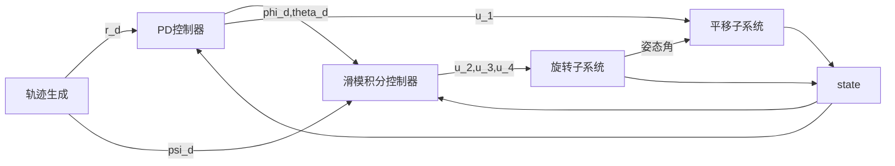

# 四旋翼仿真分析
[TOC]

## 无人机嵌入式控制

### 建模

#### 动力学方程

采用欧拉拉格朗日法：
$$
\left\{
\begin{array}{rcl}
{m \ddot x}&{=}&{-\bf u \sin \theta}\\ 
{m \ddot y}&{=}&{\bf u \cos \theta \sin \phi}\\
{m \ddot z}&{=}&{\mathbf u \cos \theta \cos \phi - mg}\\
{\ddot \phi}&{=}&\widetilde{\tau}_{\phi}\\
{\ddot \theta}&{=}&\widetilde{\tau}_{\theta}\\
{\ddot \psi}&{=}&\widetilde{\tau}_{\psi}\\
\end{array}
\right .
$$
其中$u,\widetilde{\tau}_{\phi},\widetilde{\tau}_{\theta},\widetilde{\tau}_{\psi}$为控制量，$u$为总推力，其他为力矩，$\psi$绕$z$轴，$\theta$绕$y$轴，$\phi$绕$x$轴。

高度$z$的控制：
$$
u=\frac{r_1+mg}{\cos\theta\cos\phi}\\
r_1=-a_{z_1}\dot z-a_{z_2}(z-z_d),a_{z_1},a_{z_2}>0
$$
偏航角控制：
$$
\widetilde{\tau}_{\psi}=-a_{\psi_1}\dot\psi-a_{\psi_2}(\psi-\psi_d)
$$
控制率依据[参考文献][1]，给出俯仰和滚转方向基于嵌套饱和技术的控制器：
$$
\left \{
\begin{array}{rcl}
{\widetilde{\tau}_{\phi}}&{=}&{-\sigma_{\phi_1}}\left\{\dot \phi+\sigma_{\phi_2}\left[\dot\phi+\phi+\sigma_{\phi_3}\left[\dot\phi+2\phi+\frac{\dot y}{g}+\sigma_{\phi_4}\left(\dot\phi+3\phi+3\frac{\dot y}{g}+\frac{y}{g}\right)\right]\right]\right\}\\
{\widetilde{\tau}_{\theta}}&{=}&{-\sigma_{\theta_1}}\left\{\dot \theta+\sigma_{\theta_2}\left[\dot\theta+\theta+\sigma_{\theta_3}\left[\dot\theta+2\theta-\frac{\dot x}{g}+\sigma_{\theta_4}\left(\dot\theta+3\theta+3\frac{\dot x}{g}+\frac{x}{g}\right)\right]\right]\right\}
\end{array}
\right .
$$

### 标定

### Reference

[1]: TEEL A. R., “Global stabilization and restricted tracking for multiple integrators with bounded controls”, System & Control Letters, vol. 18, pp. 165-171, 1992

 

## 采用双闭环控制器的四旋翼控制

### 建模

$$
\left\{
\begin{array}{rcl}
{\ddot x}&{=}&{u_1(\cos\phi \sin\theta \cos \psi+\sin\phi\sin\psi)-K_1\dot x/m}\\ 
{\ddot y}&{=}&{u_1(\cos\phi \sin\theta \sin \psi-\sin\phi\cos\psi)-K_2\dot y/m}\\
{\ddot z}&{=}&{u_1(\cos\phi\cos\theta) - g-K_3\dot z/m}\\
{\ddot \phi}&{=}&{u_2-lK_4\dot\phi/{I_1}}\\
{\ddot \theta}&{=}&{u_3-lK_5\dot\theta/{I_2}}\\
{\ddot \psi}&{=}&{u_4-lK_6\dot\psi/{I_3}}\\
\end{array}
\right .
$$

其中$u_1,u_2,u_3,u_4$为控制量，表示为：
$$
\left\{
\begin{array}{rcl}
u_1&=&(F_1+F_2+F_3+F_4)/m\\
u_2&=&l(-F_1-F_2+F_3+F_4)/I_1\\
u_3&=&l(-F_1-F_2+F_3+F_4)/I_2\\
u_4&=&c(F_1-F_2+F_3-F_4)/I_3\\
\end{array}
\right .
$$

### 控制逻辑

#### 位置控制

改写模型：
$$
\left\{
\begin{array}{rcl}
{\ddot x}&{=}&{u_{1_x}-K_1\dot x/m}\\ 
{\ddot y}&{=}&{u_{1_y}-K_2\dot y/m}\\
{\ddot z}&{=}&{u_{1_z} - g-K_3\dot z/m}\\
\end{array}
\right .
$$
设计PD控制器：
$$
\left\{
\begin{array}{rcl}
u_{1_x}&=&{-k_{p_x}x_e-k_{d_x}\dot x_e}\\
u_{1_y}&=&{-k_{p_y}y_e-k_{d_y}\dot y_e}\\
u_{1_z}&=&{-k_{p_z}z_e-k_{d_z}\dot z_e+g}\\
\end{array}
\right .
$$
通过$u_{1_x},u_{1_y},u_{1_z}$反解姿态角可得
$$
\left\{
\begin{array}{rcl}
\phi_d&=&{\arctan\left(\frac{\sin\psi\cos\psi u_{1_x}-\cos^2\psi u_{1_y}}{u_{1_z}}\right)}\\
\theta_d&=&{\arcsin\left(\frac{\cos^2\psi u_{1_x}+\sin\psi\cos\psi u_{1_y}}{u_{1_z}}\right)}\\
u_1&=&\frac{u_{1_z}}{\cos\phi_d\cos\psi}\\
\end{array}
\right .
$$

这里下标$e$表示期望和实际的偏差，可知，当偏差趋向于0时，$\phi_d,\theta_d$趋向于0

#### 姿态控制

姿态角取滑模控制，滑动面定义为(这里为其导数)：
$$
\left\{
\begin{array}{rcl}
{\dot S_\phi}&{=}&\ddot\phi-\ddot\phi_d+k_1(\dot\phi-\dot\phi_d)+k_2(\phi-\phi_d)\\
{\dot S_\theta}&{=}&\ddot\theta-\ddot\theta_d+k_1(\dot\theta-\dot\theta_d)+k_2(\theta-\theta_d)\\
{\dot S_\psi}&{=}&\ddot\psi-\ddot\psi_d+k_1(\dot\psi-\dot\psi_d)+k_2(\psi-\psi_d)\\
\end{array}
\right .
$$
采用指数趋近法则，得到滑动面导数的近似方程：
$$
\dot S=-M \mathsf{sgn}(S)-kS
$$
$M,k>0$

将$\ddot\phi,\ddot\theta,\ddot\psi$放在等式左侧，带入式[5] :
$$
\left\{
\begin{array}{rcl}
{u_2}&=&{lK_4\dot \phi/I_1+\ddot\phi_d-M_\phi \mathsf{sgn}(S_\phi)-k_\phi S_\phi-k_{1_\phi}(\dot\phi-\dot\phi_d)-k_{2_\phi}(\phi-\phi_d)}\\
{u_3}&=&{lK_5\dot \theta/I_2+\ddot\theta_d-M_\theta \mathsf{sgn}(S_\theta)-k_\theta S_\theta-k_{1_\theta}(\dot\theta-\dot\theta_d)-k_{2_\theta}(\theta-\theta_d)}\\
{u_4}&=&{K_6\dot \psi/I_3+\ddot\psi_d-M_\psi \mathsf{sgn}(S_\psi)-k_\psi S_\psi-k_{1_\psi}(\dot\psi-\dot\psi_d)-k_{2_\psi}(\psi-\psi_d)}\\
\end{array}
\right .
$$
则可以得到滑模控制率，由于在平衡点处使用sgn函数会产生周期性波动，因此，使用饱和函数代替:
$$
sat(y)=
\left\{
\begin{array}{ll}
y&|{y}|\leq1\\
sgn({y})&|y|>1\\
\end{array}
\right.
$$

### 仿真模拟

#### 参数设置

飞行器参数设置

|     符号      | 取值  |          单位          |
| :-----------: | :---: | :--------------------: |
|      $m$      |   2   |     $\mathbf{kg}$      |
|      $g$      |  9.8  |    $\mathbf{m/s^2}$    |
|      $l$      |  0.2  |      $\mathbf{m}$      |
|   $I_1,I_2$   | 1.25  | $\mathbf{kg\cdot m^2}$ |
|     $I_3$     |  2.5  | $\mathbf{kg\cdot m^2}$ |
| $K_1,K_2,K_3$ | 0.010 | $\mathbf{N\cdot s/m}$  |
| $K_4,K_5,K_6$ | 0.012 | $\mathbf{N\cdot s/m}$  |

控制初始值与期望值

|            变量            |      取值       |
| :------------------------: | :-------------: |
|      $(x_0,y_0,z_0)$       |    $(0,0,0)$    |
| $(\phi_0,\theta_0,\psi_0)$ |    $(0,0,0)$    |
|      $(x_d,y_d,z_d)$       |    $(4,3,5)$    |
|          $\psi_d$          | $\frac{\pi}{4}$ |

控制器参数：

|           变量           | 取值 |
| :----------------------: | :--: |
|    $k_{p_x},k_{p_y}$     | 1.8  |
|    $k_{d_x},k_{d_y}$     | 2.5  |
|        $k_{p_z}$         | 5.5  |
|        $k_{d_z}$         | 4.5  |
| $M_\phi,M_\theta,M_\psi$ |  25  |
| $k_\phi,k_\theta,k_\psi$ |  1   |
|       $k_{1_\phi}$       | 5.5  |
|       $k_{2_\phi}$       |  10  |
|      $k_{1_\theta}$      | 5.5  |
|      $k_{2_\theta}$      |  40  |
|       $k_{1_\psi}$       | 8.5  |
|       $k_{2_\psi}$       |  20  |

#### 结果曲线

